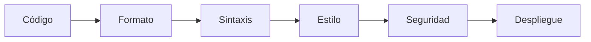

# Infrastructure as Code - AWS Secure Infrastructure

Proyecto educativo de Infrastructure as Code (IaC) utilizando Terraform para implementar infraestructura segura en Amazon Web Services con enfoque DevSecOps. La solución proporciona una arquitectura completa que incluye componentes de red, cómputo, almacenamiento y seguridad siguiendo las mejores prácticas de la industria.

## Características principales

- **Infraestructura modular**: Diseño bas# Proyecto IaC - Infraestructura Segura en AWS

## Descripción del Proyecto

Proyecto educativo de Infrastructure as Code con Terraform para crear infraestructura segura en AWS con enfoque DevSecOps. La solución incluye red (VPC), cómputo (EC2 con provisioner), almacenamiento (S3), IAM de mínimos privilegios e integración con Secrets Manager y Parameter Store.

## Arquitectura Detallada del Sistema

### Componentes principales

1. **Capa de Red (VPC)**

   - VPC `10.0.0.0/16`
   - Subred pública `10.0.1.0/24`
   - Subred privada `10.0.2.0/24`
   - Internet Gateway y Tablas de Rutas
   - Nombres y etiquetas en español

2. **Capa de Cómputo (EC2)**

   - Instancia `t2.micro` en subred pública
   - Security Group restrictivo (SSH solo desde IPs permitidas)
   - Terraform Provisioner (instala nginx)
   - IMDSv2 obligatorio
   - Volumen raíz cifrado

3. **Capa de Almacenamiento (S3)**

   - Bucket con nombre único y sufijo aleatorio
   - Cifrado por defecto (AES-256)
   - Versionado activado
   - Block Public Access activado

4. **Capa de Seguridad (IAM)**
   - Rol con privilegios mínimos para EC2
   - Instance Profile asociado a la instancia
   - Acceso de solo lectura a S3 del proyecto
   - Lectura de secretos por prefijo en Secrets Manager
   - Lectura de parámetros por ruta en Parameter Store

### Flujo de Datos

Internet → Internet Gateway → Subred Pública → EC2 → (consulta/lectura) → S3 / Secrets Manager / Parameter Store

## Decisiones Técnicas y Justificaciones

- **Módulos (network/compute/storage/iam)**: Reutilización, mantenibilidad y separación de responsabilidades.
- **Terraform Provisioner (nginx)**: Configuración automática pos-creación sin pasos manuales.
- **Security Groups restrictivos**: SSH solo desde `ips_permitidas`. HTTP público para consumo del servicio.
- **Cifrado por defecto**: Discos de EC2 cifrados, S3 con SSE AES-256. Protección de datos.
- **IMDSv2**: Recomendación AWS y cumplimiento CIS Benchmark.
- **IAM mínimo**: Rol con permisos estrictamente necesarios (principio de menor privilegio).

## Enfoque DevSecOps

- Validaciones automáticas (formato, sintaxis y seguridad) previas al deploy.
- Cifrado habilitado por defecto en almacenamiento y en EC2.
- Políticas IAM restrictivas declaradas como código.
- Escaneo de seguridad con Checkov.
- Gestión de secretos en Secrets Manager y configuración en SSM Parameter Store.

## Cumplimiento de Estándares (OWASP IaC + CIS AWS)

- Sin credenciales hardcodeadas.
- Cifrado obligatorio en S3 y volúmenes de EC2.
- Security Groups restrictivos (sin 0.0.0.0/0 para SSH).
- IAM de mínimos privilegios e Instance Profile.
- IMDSv2 requerido en EC2.
- Etiquetado consistente para gobernanza.

## Estructura de Archivos

```
proyecto-iac/
├── README.md
├── app/                    # App de ejemplo (Node.js)
├── infra/                  # IaC con Terraform
│   ├── main.tf
│   ├── variables.tf
│   ├── output.tf
│   ├── terraform.tfvars.example
│   └── modules/
│       ├── network/        # VPC, subredes, IGW, rutas
│       ├── compute/        # EC2, SG, IMDSv2, cifrado, provisioner nginx
│       ├── storage/        # S3 cifrado, versionado, BPA
│       └── iam/            # Rol mínimo e Instance Profile para EC2
└── scripts/
    ├── validar.bat
    └── validar.ps1
```

## Variables Importantes

- `ips_permitidas` (list(string)): IPs autorizadas para acceso SSH (usar /32).
- `region` (string): Región AWS para el despliegue.
- `nombre_proyecto` (string): Nombre base para etiquetas y recursos.
- `public_ssh_key` (string): Llave pública SSH para crear el key pair.
- `private_key_path` (string): Ruta a la llave privada SSH para el provisioner.
- `secret_db_password_name` (string): Nombre del secreto en Secrets Manager (opcional).
- `param_app_config_path` (string): Ruta base para parámetros en SSM (opcional).

Ejemplo en `infra/terraform.tfvars.example`:

```hcl
region          = "us-east-1"
nombre_proyecto = "proyecto-iac-basico"

ips_permitidas = [
  "1.2.3.4/32",
  "5.6.7.8/32",
  "9.10.11.12/32",
  "13.14.15.16/32",
  "17.18.19.20/32",
  "21.22.23.24/32"
]

public_ssh_key   = "ssh-rsa AAAA... usuario@equipo"
private_key_path = "C:/Users/TU_USUARIO/.ssh/id_rsa"

secret_db_password_name = "proyecto-iac/database/password"
param_app_config_path   = "/proyecto-iac/app/"
```

## Pasos de Ejecución

1. **Configurar variables**: copiar `infra/terraform.tfvars.example` a `infra/terraform.tfvars` y ajustar valores.

2. **Validaciones** (opcional pero recomendado):

   - Windows: `scripts\validar.bat`
   - PowerShell: `scripts\validar.ps1`

3. **Inicializar Terraform**:

   ```bash
   cd infra
   terraform init
   ```

4. **Revisar plan**:

   ```bash
   terraform plan
   ```

5. **Aplicar**:

   ```bash
   terraform apply
   ```

6. **Verificar**:
   - Acceder a la IP pública expuesta (nginx instalado por provisioner).

## Validaciones Obligatorias

- **Formato**: `terraform fmt`
- **Sintaxis**: `terraform validate`
- **Estilo**: `tflint infra`
- **Seguridad**: `checkov -d infra --framework terraform`

## Buenas Prácticas Aplicadas

- Modularidad por componente (network/compute/storage/iam).
- Idempotencia: Terraform aplica solo cambios necesarios.
- Seguridad por diseño: cifrado, SG restrictivos, IMDSv2, IAM mínimo.
- Validaciones automáticas antes de despliegue.
- Gestión de secretos centralizada (AWS Secrets Manager).
- Etiquetado consistente en español.

## Resumen breve por etapas (lo que se hizo y por qué)

- **Etapa 1 — Red**: VPC 10.0.0.0/16, subred pública y privada, IGW y rutas. Motivo: base de red propia, ordenada y reusable.
- **Etapa 2 — Integración de red en root**: etiquetas comunes + llamado al módulo. Motivo: gobierno/organización y consistencia.
- **Etapa 3 — EC2 y SG a la VPC del módulo**: coherencia de red y seguridad.
- **Etapa 4 — EC2 segura**: IMDSv2 requerido y disco raíz cifrado; tipo `t2.micro`. Motivo: CIS/OWASP y ahorro.
- **Etapa 5 — Cómputo**: módulo `compute` con SG propio, `user_data` (Docker) y provisioner (nginx). Motivo: automatización y consistencia.
- **Ajustes SG**: SSH solo `ips_permitidas`; HTTP público para acceso al servicio. Motivo: mínimo privilegio y exposición controlada.
- **Etapa 6 — Almacenamiento**: módulo `storage` con S3 cifrado, versionado y BPA; nombre único. Motivo: seguridad por defecto y trazabilidad.
- **Etapa 7 — Seguridad IAM**: rol mínimo para EC2 + Instance Profile; lectura controlada de S3/Secrets/SSM. Motivo: mínimo privilegio y cero secretos en código.

## Limpieza de Recursos

Para evitar costos, destruir cuando no se requiera:

````bash
cd infra
terraform destroy
```ado en módulos reutilizables
- **Seguridad por diseño**: Implementación de controles de seguridad desde el inicio
- **Cumplimiento normativo**: Adherencia a estándares OWASP IaC y CIS AWS
- **Automatización completa**: Despliegue y configuración automatizada
- **Gestión de secretos**: Integración con AWS Secrets Manager y Parameter Store

## Arquitectura del sistema

### Componentes de infraestructura

#### 1. Capa de red (VPC)
- **VPC principal**: `10.0.0.0/16`
- **Subred pública**: `10.0.1.0/24` para recursos con acceso a Internet
- **Subred privada**: `10.0.2.0/24` para recursos internos
- **Internet Gateway**: Conectividad externa controlada
- **Tablas de rutas**: Enrutamiento optimizado por tipo de subred

#### 2. Capa de cómputo (EC2)
- **Instancia**: `t2.micro` con optimización de costos
- **Ubicación**: Subred pública para acceso controlado
- **Security Groups**: Acceso SSH restringido por IP
- **Seguridad**: IMDSv2 obligatorio y cifrado de volumen raíz
- **Automatización**: Provisioner de Terraform para instalación de nginx

#### 3. Capa de almacenamiento (S3)
- **Bucket único**: Nomenclatura con sufijo aleatorio
- **Cifrado**: AES-256 habilitado por defecto
- **Versionado**: Control de cambios activado
- **Acceso público**: Bloqueado por configuración de seguridad

#### 4. Capa de seguridad (IAM)
- **Principio de menor privilegio**: Permisos mínimos necesarios
- **Rol de instancia**: Instance Profile asociado a EC2
- **Acceso controlado**: Lectura de S3, Secrets Manager y Parameter Store
- **Gestión centralizada**: Sin credenciales hardcodeadas

### Flujo de datos

````

Internet → Internet Gateway → Subred Pública → EC2 Instance
↓
S3 / Secrets Manager / Parameter Store

```

## Estructura del proyecto

```

proyecto-iac/
├── README.md # Documentación principal
├── app/ # Aplicación de ejemplo (Node.js)
├── infra/ # Código de infraestructura
│ ├── main.tf # Configuración principal
│ ├── variables.tf # Variables de entrada
│ ├── output.tf # Valores de salida
│ ├── terraform.tfvars.example # Plantilla de variables
│ └── modules/ # Módulos de Terraform
│ ├── network/ # VPC, subredes, gateway, rutas
│ ├── compute/ # EC2, Security Groups, provisioning
│ ├── storage/ # S3 con configuración segura
│ └── iam/ # Roles y políticas IAM
└── scripts/ # Scripts de validación
├── validar.bat # Validación para Windows
└── validar.ps1 # Validación para PowerShell

````

## Configuración de variables

### Variables principales

| Variable | Tipo | Descripción | Ejemplo |
|----------|------|-------------|---------|
| `ips_permitidas` | list(string) | IPs autorizadas para SSH (formato /32) | `["1.2.3.4/32"]` |
| `region` | string | Región AWS para despliegue | `"us-east-1"` |
| `nombre_proyecto` | string | Nombre base para recursos | `"proyecto-iac-basico"` |
| `public_ssh_key` | string | Llave pública SSH | `"ssh-rsa AAAA..."` |
| `private_key_path` | string | Ruta a llave privada SSH | `"~/.ssh/id_rsa"` |
| `secret_db_password_name` | string | Nombre del secreto en Secrets Manager | Opcional |
| `param_app_config_path` | string | Ruta base para parámetros SSM | Opcional |

### Archivo de configuración

Crear `infra/terraform.tfvars` basado en `terraform.tfvars.example`:

```hcl
region          = "us-east-1"
nombre_proyecto = "proyecto-iac-basico"

ips_permitidas = [
  "203.0.113.1/32",    # Oficina principal
  "198.51.100.2/32",   # Oficina secundaria
  "192.0.2.3/32"       # VPN corporativa
]

public_ssh_key   = "ssh-rsa AAAAB3NzaC1yc2EAAAAD... usuario@equipo"
private_key_path = "/home/usuario/.ssh/id_rsa"

# Configuración opcional de servicios AWS
secret_db_password_name = "proyecto-iac/database/password"
param_app_config_path   = "/proyecto-iac/app/"
````

## Implementación paso a paso

### 1. Preparación del entorno

```bash
# Clonar el repositorio
git clone <repository-url>
cd proyecto-iac

# Configurar variables
cp infra/terraform.tfvars.example infra/terraform.tfvars
# Editar terraform.tfvars con tus valores específicos
```

### 2. Validaciones de seguridad (recomendado)

**Windows:**

```cmd
scripts\validar.bat
```

**PowerShell/Linux:**

```bash
scripts/validar.ps1
```

Las validaciones incluyen:

- **Formato**: `terraform fmt`
- **Sintaxis**: `terraform validate`
- **Estilo**: `tflint`
- **Seguridad**: `checkov`

### 3. Despliegue de infraestructura

```bash
# Inicializar Terraform
cd infra
terraform init

# Revisar plan de ejecución
terraform plan

# Ir directorio
dir "%USERPROFILE%\.ssh"

# ver ssh privada
type "%USERPROFILE%\.ssh\id_rsa"

# Conect
ssh -i "C:\Users\jsahonero\.ssh\mi-llave.pem" ec2-user@3.84.183.150

# Desaptivar
sudo systemctl stop nginx
sudo systemctl disable nginx
sudo systemctl status nginx

# VVER LOGS DOCKER
docker logs demo-microservice-lab

# Aplicar cambios
terraform apply `
  -var="public_ssh_key=$(Get-Content $env:USERPROFILE\.ssh\id_rsa.pub -Raw)" `
  -var="private_key_path=$env:USERPROFILE\.ssh\id_rsa"
```

¿Qué hace ese comando?
Le dice a Terraform: “crea mi infraestructura y usa mis llaves SSH”.
terraform apply: crea/actualiza lo que está definido en tus archivos .tf.
Primera -var=public_ssh_key=...: lee el texto de tu llave pública (id_rsa.pub) y se la pasa a Terraform.
$(Get-Content ... -Raw): abre y lee ese archivo como texto.
Segunda -var=private_key_path=...: le da a Terraform la ruta donde está tu llave privada (id_rsa).
¿Para qué sirven en tu proyecto?
Con la llave pública, AWS crea un aws_key_pair para que tu EC2 permita tu acceso SSH.
Con la llave privada, el “provisioner” se conecta por SSH a la EC2 e instala nginx automáticamente.

### 4. Verificación del despliegue

```bash
# Obtener IP pública de la instancia
terraform output ec2_public_ip

# Verificar servicio web (nginx)
curl http://<EC2_PUBLIC_IP>

# Acceso SSH para diagnóstico
ssh -i ~/.ssh/id_rsa ec2-user@<EC2_PUBLIC_IP>
```

## Aspectos de seguridad

### Cumplimiento normativo

**OWASP Infrastructure as Code:**

- Sin credenciales en código fuente
- Cifrado obligatorio en almacenamiento
- Validaciones automatizadas de seguridad
- Gestión centralizada de secretos

**CIS AWS Foundations Benchmark:**

- Security Groups restrictivos
- IMDSv2 requerido en instancias EC2
- Cifrado de volúmenes EBS
- IAM con principio de menor privilegio

### Controles implementados

| Control             | Implementación             | Justificación                       |
| ------------------- | -------------------------- | ----------------------------------- |
| Acceso SSH          | Solo desde IPs autorizadas | Prevención de acceso no autorizado  |
| Cifrado S3          | AES-256 por defecto        | Protección de datos en reposo       |
| IMDSv2              | Obligatorio en EC2         | Prevención de ataques SSRF          |
| IAM restrictivo     | Permisos mínimos           | Principio de menor privilegio       |
| Block Public Access | Activado en S3             | Prevención de exposición accidental |

## Enfoque DevSecOps

### Integración de seguridad

- **Shift-left security**: Validaciones en fase de desarrollo
- **Compliance as code**: Políticas de seguridad como código
- **Automated scanning**: Escaneo automático con Checkov
- **Secret management**: Gestión segura de credenciales

### Pipeline de validación


```mermaid
graph LR
    A[Código] --> B[Formato]
    B --> C[Sintaxis]
    C --> D[Estilo]
    D --> E[Seguridad]
    E --> F[Despliegue]
```

## Monitoreo y troubleshooting

### Comandos de diagnóstico

```bash
# Estado de recursos
terraform state list

# Información detallada de recursos
terraform state show <resource_name>

# Logs de la instancia EC2
ssh -i ~/.ssh/id_rsa ec2-user@<IP> 'sudo journalctl -u nginx'

# Validar conectividad
curl -I http://<EC2_PUBLIC_IP>
```

### Resolución de problemas comunes

| Problema               | Causa probable       | Solución                        |
| ---------------------- | -------------------- | ------------------------------- |
| SSH connection refused | IP no autorizada     | Verificar `ips_permitidas`      |
| Nginx no responde      | Servicio no iniciado | Revisar user_data y provisioner |
| Terraform apply falla  | Credenciales AWS     | Verificar configuración AWS CLI |
| Acceso S3 denegado     | Políticas IAM        | Revisar permisos del rol        |

## Gestión del ciclo de vida

### Actualización de infraestructura

```bash
# Revisar cambios propuestos
terraform plan

# Aplicar actualizaciones
terraform apply

# Verificar estado post-actualización
terraform refresh
```

### Limpieza de recursos

```bash
# Destruir infraestructura
cd infra
terraform destroy

# Confirmar eliminación de recursos
terraform state list  # Debe estar vacío
```

## Mejores prácticas aplicadas

### Diseño modular

- Separación por responsabilidades (red, cómputo, almacenamiento, IAM)
- Reutilización de componentes
- Mantenibilidad mejorada

### Seguridad por diseño

- Cifrado habilitado por defecto
- Principio de menor privilegio
- Validaciones automáticas

### Operaciones

- Idempotencia garantizada
- Versionado de infraestructura
- Documentación como código

## Consideraciones de costos

### Optimización implementada

- Instancias `t2.micro` (elegible para free tier)
- Recursos mínimos necesarios
- Automatización para evitar recursos huérfanos

Resumen

Modularidad por componente (network/compute/storage/iam).
Idempotencia: Terraform aplica solo cambios necesarios.
Seguridad por diseño: cifrado, SG restrictivos, IMDSv2, IAM mínimo.
Validaciones automáticas antes de despliegue.
Gestión de secretos centralizada (AWS Secrets Manager).
Etiquetado consistente en español.

Resumen breve de lo realizado por etapas
Etapa 1 — Módulo de red (modules/network):
Se creó VPC 10.0.0.0/16 con subred pública y privada, Internet Gateway y ruteo.
Motivo: base de red propia, ordenada y reusable. Cumple estructura modular y tags.
Etapa 2 — Integración de red en infra/main.tf:
Se agregaron etiquetas comunes y se llamó al módulo network.
Motivo: gobierno y trazabilidad. Cumple nombres/etiquetas en español.
Etapa 3 — EC2 y SG a la nueva VPC:
SG atado a la VPC del módulo y EC2 usando la subred pública del módulo.
Motivo: coherencia de red y seguridad. Cumple modularidad.
Etapa 4 — Endurecimiento de EC2:
IMDSv2 requerido y cifrado del volumen raíz; t2.micro.
Motivo: buenas prácticas CIS/OWASP. Cumple "IMDSv2" y "cifrado obligatorio".
Etapa 5 — Módulo de cómputo (modules/compute):
EC2 con Security Group propio, user_data instalando Docker y Provisioner instalando nginx.
Motivo: automatización y consistencia. Cumple "Terraform Provisioner".
Ajustes de SG (alineados a las reglas del proyecto):
SSH restringido a ips_permitidas (sin 0.0.0.0/0).
HTTP público para que el servicio sea accesible.
Motivo: principio de mínimo privilegio y acceso controlado. Cumple "sin 0.0.0.0/0 en SSH".
Etapa 6 — Módulo de almacenamiento (modules/storage):
S3 con cifrado AES-256, versionado y Block Public Access; nombre único con sufijo.
Motivo: seguridad por diseño y trazabilidad. Cumple "cifrado y versionado en S3".
Integración y salidas:
module compute y module storage integrados en infra/main.tf; outputs útiles añadidos.
Motivo: visibilidad post-deploy. Cumple estructura modular y outputs.
Variables y validaciones:
Variables clave (ips_permitidas, private_key_path, nombre_proyecto, etc.) y ejemplo de tfvars.
Scripts de validación (formato/validación/seguridad) propuestos.
Motivo: DevSecOps y control previo. Cumple "validaciones automáticas".

🚀 CÓMO EJECUTAR EL PROYECTO

# 1. ENTRAR A LA CONSOLA (CMD)

# 2. ENTRA A

cd infra

# 2.2 Para que ? Por que se hace ? Es obligatorio funcione ?

# Para que: Descarga e instala los providers necesarios (como AWS)

# Por que se hace: Terraform necesita estos plugins para comunicarse con AWS

# Es obligatorio: SÍ, sin esto Terraform no puede funcionar

terraform init

# 2.3 Para que ? Por que se hace ? Es obligatorio funcione ?

# Para que: Muestra qué recursos se van a crear/modificar/eliminar

# Por que se hace: Para revisar los cambios antes de aplicarlos

# Es obligatorio: NO, pero es buena práctica para evitar sorpresas

terraform plan

# 2.1 Explicacion

# Le dice a Terraform: "crea mi infraestructura y usa mis llaves SSH".

# terraform apply: crea/actualiza lo que está definido en tus archivos .tf.

# Primera -var=public_ssh_key=...: lee el texto de tu llave pública (id_rsa.pub) y se la pasa a Terraform.

# Segunda -var=private_key_path=...: le da a Terraform la ruta donde está tu llave privada (id_rsa).

# Con la llave pública, AWS crea un aws_key_pair para que tu EC2 permita tu acceso SSH.

# Con la llave privada, el "provisioner" se conecta por SSH a la EC2 e instala nginx automáticamente.

terraform apply -var="public_ssh_key=$(type %USERPROFILE%\.ssh\id_rsa.pub)" -var="private_key_path=%USERPROFILE%\.ssh\id_rsa"

# Despues ir a Configuracion GitHub del repositorio (Settings) -> (Secrets and variables) -> (Actions) -> (Secrets)

APP_PORT = 3000
DOCKERHUB_TOKEN = (Debemos ir Docker Hub)
DOCKERHUB_USERNAME = crayolito
EC2_HOST = (Levantar el EC2 Terraform poner la ip publica)
EC2_SSH_KEY = (Poner la llave Privada del SSH)
EC2_USER = ec2-user

# Primero vamos a generarla pero no debemos ya la tenemos

# Que hace este comando

# Secciones lo que hace con que fin

ssh-keygen -t rsa -b 4096 -C "tu_correo@example.com"

# Ya lo tenemos iremos a verificar si esta en la direccion de carpeta

dir %USERPROFILE%\.ssh

# con este comando se va visualizar en consola

type %USERPROFILE%\.ssh\id_rsa

# NOTA IMPORTANTE EN EL .YML el contenedor usar PORT 3000 pero EC2 se comunica con 8080

# YA QUE ESTA COMO 8080:3000

# Vamos a conectarnos por SSH para saber si todo esta funcionando bien

ssh -i ~/.ssh/id_rsa ec2-user@<EC2_PUBLIC_IP>

# Procedemos a verificar que el Terraform Provisioner haya funcionado correctamente

# diferencias clave sencilla de

# user_data es mejor por defecto corre al arranque sin SSH y se puede usar subred privada

# El PROVISIONER se usa cuando es algo via SSH post-boot igual script se ejecuta Despues de que la instancia este corriendo solo es para demostracion

# Nginx

# Es como Apache un servidor Web sirve por si alguien visita la IP publica EC2 desde el navegador

# Verifiquemos los logs del contenedor

# docker logs demo-microservice-lab

# Procedemos a verificar por el puerto

# http://<EC2_PUBLIC_IP>:8080/Hola

# Vamos a ejecutar los el Scprit que tenemos para Windows para la validacion de sintaxis
